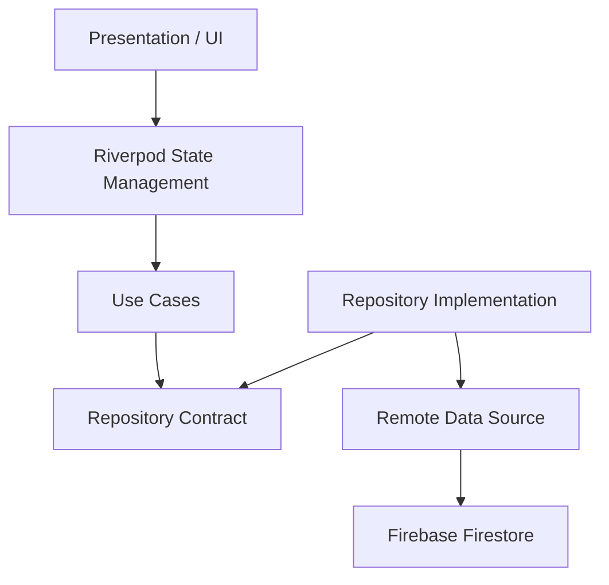
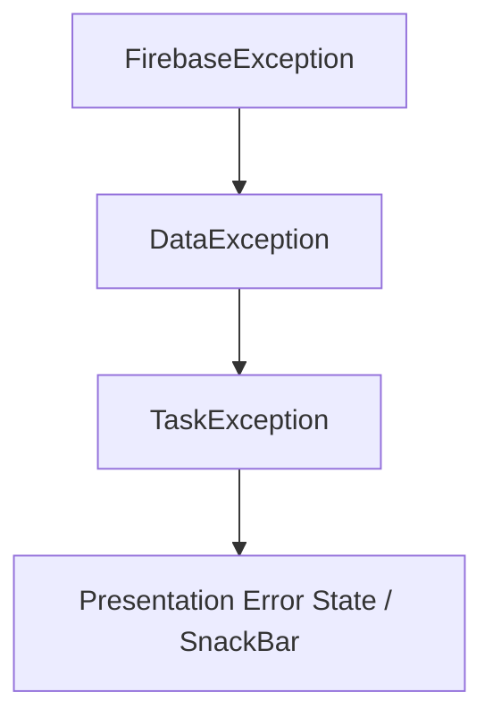

# Flutter Clean Architecture Template

> **Note**: This repository is intentionally small. The domain is simple so the focus stays on architecture, dependency boundaries, error handling, and testing.

A small Flutter task-management app built to demonstrate practical Clean Architecture, dependency inversion, Riverpod state management, Firebase integration, error translation, and unit testing.

The goal of this repository is not to showcase a complex product. It is to show how I structure Flutter applications so business logic stays independent from frameworks and infrastructure.

---

## Architecture

The project follows a feature-first Clean Architecture structure.



### Dependency Rule

Inner layers do not depend on outer layers.

The domain layer has no knowledge of:
- Firebase
- Firestore
- Riverpod
- Flutter widgets
- Dio or HTTP clients

Infrastructure details stay outside the domain.

---

## Project Structure

```text
lib/
├── core/
│   ├── di/
│   │   └── injection.dart
│   └── error/
│       └── data_exception.dart
│
├── features/
│   └── tasks/
│       ├── domain/
│       │   ├── entities/
│       │   │   └── task_entity.dart
│       │   ├── repositories/
│       │   │   └── task_repository.dart
│       │   ├── exceptions/
│       │   │   └── task_exception.dart
│       │   └── usecases/
│       │       ├── create_task_usecase.dart
│       │       ├── get_tasks_usecase.dart
│       │       ├── get_task_by_id_usecase.dart
│       │       ├── update_task_usecase.dart
│       │       └── delete_task_usecase.dart
│       │
│       ├── data/
│       │   ├── models/
│       │   │   └── task_model.dart
│       │   ├── datasources/
│       │   │   └── task_remote_datasource.dart
│       │   └── repositories/
│       │       └── task_repository_impl.dart
│       │
│       └── presentation/
│           ├── providers/
│           │   └── task_provider.dart
│           ├── pages/
│           │   └── task_list_page.dart
│           └── widgets/
│               └── create_task_sheet.dart
│
├── firebase_options.dart
└── main.dart
```

---

## Data Flow

Creating a task follows this path:

```text
CreateTaskSheet
      ↓
TaskNotifier
      ↓
CreateTaskUseCase
      ↓
TaskRepository (contract)
      ↓
TaskRepositoryImpl
      ↓
TaskRemoteDataSource
      ↓
Firebase Firestore
```

The presentation layer never accesses Firestore directly.

---

## Error Flow

Infrastructure errors are translated as they move inward.



Each layer only knows about the error type appropriate to its responsibility.

### Example

```text
Firebase: permission-denied
      ↓
Data layer: DataException
      ↓
Repository: TaskException
      ↓
UI: "You do not have permission to perform this action"
```

This prevents backend-specific error messages from leaking into the UI.

---

## State Management

Riverpod is used in the presentation layer.

Two separate state concerns are intentionally maintained:
- `taskProvider` → task-list state → loading / data / error
- `taskActionProvider` → create / update / delete action state

This avoids replacing the entire task list with a loading spinner while performing mutations. For example, deleting a task keeps the current list visible while the action is processed.

---

## Dependency Injection

Dependencies are wired manually in a composition root:

```text
FirebaseFirestore
      ↓
TaskRemoteDataSourceImpl
      ↓
TaskRepositoryImpl
      ↓
Use Cases
      ↓
Riverpod
```

Manual dependency injection was chosen deliberately to keep the dependency graph explicit. A service locator such as GetIt could be added later without changing the domain architecture.

---

## Testing

The project currently contains unit tests across multiple layers (**14 tests**).

Coverage includes:
- Use-case delegation
- Entity-to-model repository mapping
- Infrastructure-to-domain error translation
- JSON serialization
- Firestore document-ID handling
- Riverpod notifier state transitions
  - Loading, data, and error states
  - Create, update, and delete state refresh behavior

Run the test suite with:
```bash
flutter test
```

Static analysis:
```bash
dart analyze
```

---

## Key Architectural Decisions

### Why separate `TaskEntity` and `TaskModel`?
`TaskEntity` represents the business object used by the domain. `TaskModel` represents the external data format used by the data layer. This allows the backend representation to change without forcing the domain model to depend on it.

### Why does the repository interface live in the domain layer?
The domain defines what data operations it needs. The data layer implements those requirements.

Therefore:
- **Domain defines contract**
- **Data implements contract**

This keeps the dependency direction pointing inward.

### Why use use cases for simple CRUD?
The current use cases are intentionally thin. Their purpose is to establish a business-logic boundary. If business rules grow later, they can be added inside the use case without moving logic into UI or infrastructure code.

### Why not catch every exception?
Only infrastructure-specific exceptions such as `FirebaseException` are translated. Programming errors such as `TypeError` or invalid application state are not disguised as database errors. This keeps failures easier to debug.

---

## Tech Stack

- **Flutter** & **Dart**
- **Riverpod** (State Management)
- **Firebase Core** & **Cloud Firestore** (Backend & Data Persistence)
- **Clean Architecture**
- **Repository Pattern**
- **Manual Dependency Injection** (Composition Root)
- **Unit Testing** (`flutter_test`)

---

## What This Repository Demonstrates

This repository focuses on engineering structure rather than UI complexity.

It demonstrates:
- Separation of concerns
- Dependency inversion
- Testable domain logic
- Framework-independent business models
- Infrastructure error isolation
- Predictable state management
- Explicit dependency composition
- Production-oriented Flutter organization

---

## Author

**Muhammad Mansoor Satti**  
Flutter Developer — Mobile & Web  
- **GitHub**: [https://github.com/Satti201](https://github.com/Satti201)  
- **Portfolio**: [https://satti201.github.io](https://satti201.github.io/)  
- **LinkedIn**: [https://www.linkedin.com/in/muhammad-mansoor-satti-316769233/](https://www.linkedin.com/in/muhammad-mansoor-satti-316769233/)
